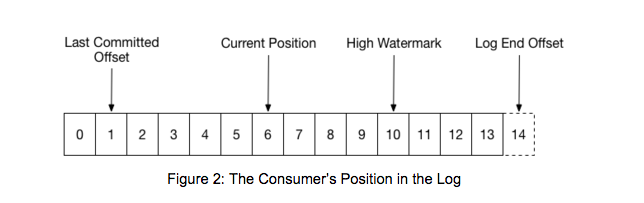

# Kafka Basic Introduction

For each group, one of the brokers is selected as the group coordinator.

## Group Coordinator Responsibilities

- Mediate partition assignment when members change.
- Mediate partition assignment when topic metadata changes.
- Reassigning partitions is called rebalancing.

## Partition Offsets

- Last committed offset: The offset that the consumer last fully processed
- Current position: The current position of the consumer.
- High watermark: The offset of the last message that was successfully copied to all of the log’s replicas. You can only consume up to the high watermark.
- Log end offset: The offset of the most recent message.

## Subscribing to a Topic

You can subscribe by doing:
`consumer.subscribe([“topic1”, “topic2”])`

The consumer will then coordinate with the rest of the group to assign partitions.
This is done automatically. You can actually assign partitions in two ways:

- Automatically.
- Manually via the assign API.

You can’t mix the two methods.

## Minimum Consumer Properties

The following properties are the minimum required for a consumer:
- Bootstrap servers
- Group id
- Key deserializer
- Value deserializer

